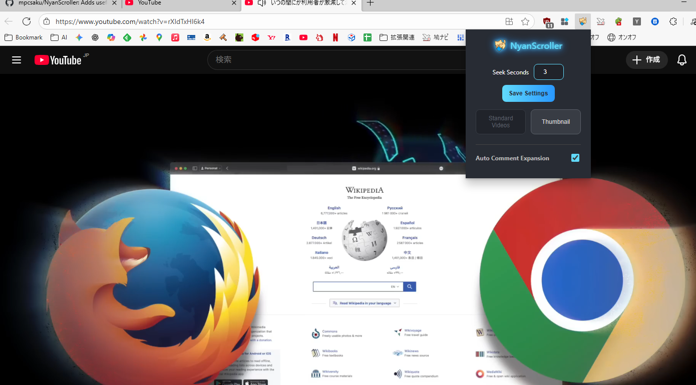

# 😻 NyanScroller: YouTube Shortsをストレスフリーにする最強ツール！

  

YouTube Shortsは楽しいけど、**「早送り・巻き戻しができない」「低評価数が見たい」「勝手に次の動画にスクロールされる」**といった不満はないですか？

  <h2 style="color: #61dafb; margin-top: 0;">解決！</h2>
  
<strong>NyanScroller（ニャンスクローラー）</strong>は、そんなあなたの不満をすべて解決！

  
ショート動画に「欲しかった機能」を全て追加し、あなたの視聴体験を劇的に改善するChrome拡張機能です。

---

## ✨ NyanScrollerの主要機能

  
  

    <h3 style="color: #61dafb;">1. ⏪ 再生時間の自由な操作（早送り・巻き戻し）</h3>
    
ショート動画でも、まるで通常の動画のように再生時間をコントロールできます。

    <ul>
        <li>キーボードの<strong>矢印キー</strong> (← / →) で、動画の再生時間を移動！</li>
        <li>ポップアップから移動する秒数を<strong style="color: #f7b731;">0.1秒単位で細かく設定可能</strong>です。</li>
    </ul>
  

  

    <h3 style="color: #fff;">2. 🤫 失われた情報の復活と可視化</h3>
    
動画の真の評価や背景を知るための情報にアクセスできます。

    <ul>
        <li><strong style="color: #ff6b6b;">非表示になった低評価数</strong>を、ショート動画・通常動画問わず表示します。</li>
        <li>ショート動画の画面に、<strong>正確な投稿日時と再生回数</strong>を表示します。</li>
    </ul>
  

  
  

    <h3 style="color: #fff;">3. 👯‍♀️ ショート動画を通常動画へ切り替え＆サムネイル取得</h3>
    <ul>
        <li><strong>ワンクリックで通常動画形式に切り替え</strong>。コメント欄や関連動画をチェックできます。</li>
        <li><strong>高画質なサムネイル画像を直接取得</strong>。気になる動画の素材をすぐに確認・保存できます。</li>
        <li>これらの操作は、Shorts画面上のボタンや、**ショートカットキー**からも実行可能です。</li>
    </ul>
  

---

## 🌟 その他の便利な機能

* **📝 コメント入力中の自動スクロール停止**:
    コメント欄に文字を入力している間は、動画が終わっても勝手に次の動画にスクロールされません。あなたの集中を邪魔しません！
* **コメント欄の自動展開ON/OFF設定**:
    デスクトップでShortsを開いたときに、コメント欄を自動で開くかどうかを自由に設定できます。

---

## 📢 インストールして、あなたのYouTubeライフをアップグレード！

NyanScrollerを導入するだけで、あなたのYouTube Shorts視聴体験は、<strong style="color: #61dafb;">ストレスフリー</strong>で<strong style="color: #61dafb;">情報豊富</strong>な環境に生まれ変わります。

今すぐNyanScrollerをインストールして、より快適なYouTube Shortsライフを始めましょう！😸✨

---