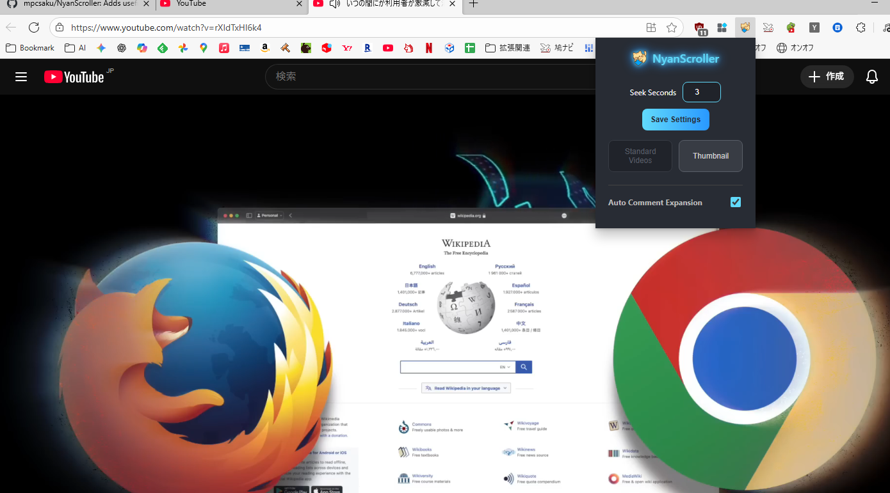

#   NyanScroller - Elevate Your YouTube Viewing Experience!

"NyanScroller" is a versatile Chrome extension designed to make viewing **YouTube Shorts** and regular videos more comfortable while providing enhanced access to useful information.

---

## 🚀 Key Features

### 1. Enhanced Shorts Playback

The extension addresses shortcomings in YouTube Shorts, offering a more convenient environment.

* **⏩ Added Seek Functionality (Arrow Key Support)**
    Allows for precise rewinding and fast-forwarding of the video by a customizable number of seconds.
    * **$\text{←}$ (Left Arrow Key)**: Rewind
    * **$\text{→}$ (Right Arrow Key)**: Fast Forward
* **▶️ Automatic Scroll on Video End**
    Automatically scrolls to the next Short when the current video finishes playing.
    * **Comment Lock Feature**: Auto-scrolling is temporarily paused if you focus on the comment input field.
* **📅 Display Publish Date and View Count**
    A badge overlay shows the video's publication date (`publishedAt`) and current view count (`viewCount`) on the player.
* **👎 Restore Dislike Count**
    The hidden dislike count is restored using an external API (`returnyoutubedislikeapi.com`).
* **💬 Automatic Comment Expansion**
    Automatically expands the comment section when a Short is opened (toggle ON/OFF in settings).

### 2. Convenient Actions and Settings

The extension's pop-up and video page include handy shortcuts and customization options.

* **🎬 Open as Regular Video**
    Opens the currently viewed Short in the full-size **regular video (watch) page**.
    * *Shortcut Key: $\text{Ctrl}+\text{Right}$*
* **🖼️ Get Thumbnail**
    Opens the high-quality thumbnail image (`/sddefault.jpg`) for the current video in a new tab.
    * *Shortcut Key: $\text{Ctrl}+\text{Left}$*
* **⚙️ Customize Seek Seconds**
    The pop-up allows you to set and save the arrow key seek duration (default is $\text{2}$ seconds) in $\text{0.1}$ second increments.
#

 

#

# NyanScroller - YouTubeShortsの視聴体験をネクストレベルへ！

「NyanScroller」は、YouTubeの**ショート動画 (YouTube Shorts)** や通常動画の視聴をより快適にし、役立つ情報へのアクセスを向上させるための多機能なChrome拡張機能です。

---

## 🚀 主な機能

### 1. ショート動画の操作性向上

YouTube Shortsの欠点を補い、快適な操作環境を提供します。

* **⏩ スキップ機能の追加（アローキー対応）**
    設定した秒数で動画を細かく巻き戻し・早送りできます。
    * **$\text{←}$ (左アローキー)**: 巻き戻し
    * **$\text{→}$ (右アローキー)**: 早送り
* **▶️ 動画終了時の自動スクロール**
    ショート動画が最後まで再生されると、自動で次の動画へスクロールします。
    * **コメント入力ロック機能**: コメント入力欄などにフォーカスすると、自動スクロールは一時停止されます。
* **📅 投稿日時と再生数の表示**
    プレイヤー上に、その動画がいつ公開されたか（`publishedAt`）と現在の再生数（`viewCount`）をバッジで表示します。
* **👎 低評価数（Dislike Count）の再表示**
    外部API（`returnyoutubedislikeapi.com`）を利用して低評価数を再表示します。
* **💬 コメントの自動展開**
    ショート動画を開くと、自動的にコメント欄を展開します（設定でON/OFFを切り替え可能）。

### 2. 便利なアクションボタンと設定

拡張機能のポップアップや動画再生画面に、便利なショートカット機能を提供します。

* **🎬 通常動画で開く**
    視聴中のショート動画を、フルサイズの**通常動画 (watch) ページ**で開きます。
    * *ショートカットキー：$\text{Ctrl}+\text{Right}$*
* **🖼️ サムネイルを取得**
    視聴中の動画の高画質サムネイル（`/sddefault.jpg`）を別タブで開きます。
    * *ショートカットキー：$\text{Ctrl}+\text{Left}$*
* **⚙️ スキップ秒数のカスタマイズ**
    ポップアップ画面で、アローキーによるスキップ秒数（デフォルトは $\text{2}$ 秒）を $0.1$ 秒単位で自由に設定・保存できます。
#

 

 #